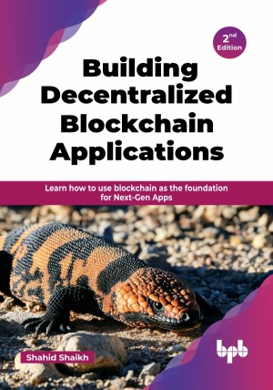

# Building Decentralized Blockchain Applications - 2nd Edition

Learn how to use blockchain as the foundation for Next-Gen Apps.

This is the repository for [Building Decentralized Blockchain Applications - 2nd Edition
](https://bpbonline.com/products/building-decentralized-blockchain-applications-2nd-edition?variant=44407741153480),published by BPB Publications.

## About the Book
Blockchain is a revolutionary technology that shook the core of the finance world. However, Blockchain is not just about cryptocurrency.

This book focuses on blockchain, its features, and the core technologies used to build the Blockchain network. In the first section, you will learn about blockchain in-depth. You will learn how these currencies work and how you can build your applications using them. This edition focuses on Ethereum as a platform for building decentralized applications (DApps) and smart contract development using Solidity. You will learn about decentralized databases like OrbitDB, BigchainDB, TiesDB, and Bluzelle, and understand their role in building next-generation applications. 

You will also learn about various databases and how to use them in detail. Lastly, you will understand how the existing DApps work, their architecture, and how they are incorporated into the application for the end-user.

## What You Will Learn
• Learn to build your own P2P network.

• Cutting-edge coverage on how cryptocurrency works.

• Learn smart techniques to develop your own DApps on the Ethereum platform.

• Learn to use decentralized databases, including OrbitDB.

• Implement PoW, PoS, and PBFT to secure blockchain networks and analyze sharding and layer-2 techniques for scalability.
